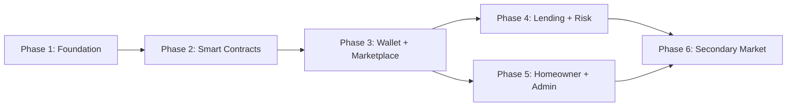

# Roadmap: SolNest

## Milestone: v1.0 — Per-Project Solar Lending Platform

### Phase 1: Codebase Foundation
**Goal:** Build reliable foundation — types, tests, clean architecture, error handling.

Plans:
- Enable TypeScript strict mode, fix type issues
- Install Vitest + React Testing Library, write first test
- Extract business logic into custom hooks (wallet, calculations, project data)
- Replace `alert()` with toast notification system and error boundaries
- Migrate hardcoded strings to translation dictionary

**Requirements:** TCH-01, TCH-02, TCH-03, TCH-04, TCH-05

---

### Phase 2: Smart Contracts
**Goal:** Solidity contracts for per-project lending markets.

Plans:
- ProjectMarketFactory (project deployment + registry)
- ProjectMarket (deposit, withdraw, repay, claim, lifecycle)
- LP token (ERC-20) per project
- Admin roles and project lifecycle management
- Hardhat dev environment + test suite

**Requirements:** SC-01, SC-02, SC-03, SC-04, SC-05, SC-06

---

### Phase 3: Wallet Integration & Project Marketplace
**Goal:** Connect real wallets, browse and view projects on-chain.

Plans:
- Install wagmi v2 + viem, configure wallet providers
- Implement connect/disconnect wallet flow
- Display real wallet balances and network info
- Project marketplace (browse active projects from contracts)
- Project detail page (target, APY, duration, funding progress)

**Requirements:** WAL-01, WAL-02, WAL-03, MKT-01, MKT-02, MKT-03

---

### Phase 4: Lending & Risk
**Goal:** Core lending flows — deposit, withdraw, claim, risk transparency.

Plans:
- Deposit into project market
- Withdraw during funding phase
- View investor LP token positions
- Claim repaid principal + interest
- Risk metrics display per project

**Requirements:** LND-01, LND-02, LND-03, LND-04, RSK-01, RSK-02

---

### Phase 5: Homeowner Portal & Admin Panel
**Goal:** Repayment flows, energy tracking, admin project management.

Plans:
- Homeowner loan dashboard (terms, schedule, repayments)
- Energy production vs projection tracking
- Inverter telemetry visualizations
- Admin project creation form
- Admin lifecycle management UI

**Requirements:** HOM-01, HOM-02, HOM-03, HOM-04, ADM-01, ADM-02, ADM-03, ADM-04

---

### Phase 6: Secondary Market
**Goal:** Allow investors to trade LP positions.

Plans:
- List LP tokens for sale (order creation)
- Buy LP tokens from other investors
- Order book / active offers per project

**Requirements:** SEC-01, SEC-02, SEC-03

---

## Dependencies

## Estimated Effort

| Phase | Plans | Dependencies | Theme |
|-------|-------|-------------|-------|
| 1 | 5 | None | Code quality |
| 2 | 6 | Phase 1 | Blockchain |
| 3 | 6 | Phase 2 | UX + Web3 |
| 4 | 6 | Phase 3 | Core lending |
| 5 | 8 | Phase 3 | User portals |
| 6 | 3 | Phase 4, 5 | Liquidity |

---
*Roadmap created: 2026-05-22 after project initialization*
