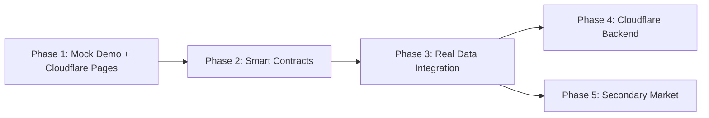

# Roadmap: SolNest

## Milestone: v1.0 — Per-Project Solar Lending Platform

### Phase 1: Mock Everything + Stakeholder Demo
**Goal:** Complete functional demo with mock data — deploy to Cloudflare Pages for stakeholder walkthrough. All features functional, all data simulated.

Plans:
- Set up Cloudflare Pages deployment (frontend hosting)
- Build complete mock service layer (projects, wallets, lending, risk, telemetry) — easy to swap for real data later
- Marketplace: browse projects, filter/sort, project detail with full metrics (target, APY, duration, funding progress, risk)
- Lending flows: mock deposit, withdraw, claim per project
- Portfolio: investor positions across all projects
- Homeowner portal: loan dashboard, mock repayment, energy tracker, inverter telemetry
- Admin panel: project creation form, lifecycle management UI
- Secondary market: list and buy LP positions
- Codebase hardening: TypeScript strict mode, test infra, toast notifications, error boundaries, translation cleanup

**Requirements:** TCH-01-05, DEM-01-08, WAL-01 (mock), CLO-01

---

### Phase 2: Smart Contracts
**Goal:** Solidity contracts for per-project lending markets, deployed to testnet.

Plans:
- ProjectMarketFactory (project deployment + registry)
- ProjectMarket (deposit, withdraw, repay, claim, lifecycle)
- LP token (ERC-20) per project
- Admin roles and project lifecycle management
- Hardhat dev environment + test suite
- Deploy to testnet (Sepolia)

**Requirements:** SC-01, SC-02, SC-03, SC-04, SC-05, SC-06

---

### Phase 3: Real Data Integration
**Goal:** Replace mock data with real on-chain data from deployed contracts.

Plans:
- Install wagmi v2 + viem, configure wallet providers
- Replace mock wallet with real wallet connect (MetaMask, WalletConnect)
- Connect marketplace to real ProjectMarket contract data
- Real deposit, withdraw, claim transactions
- Real portfolio balances from on-chain LP token positions
- Real homeowner data from contract state
- Real admin lifecycle management via contract calls

**Requirements:** WAL-01-03 (real), MKT-01-03 (real), LND-01-04 (real), HOM-01-04 (real), ADM-01-04 (real)

---

### Phase 4: Cloudflare Backend + Production Polish
**Goal:** Off-chain services via Cloudflare Workers, production readiness.

Plans:
- Cloudflare Workers for off-chain services (project metadata, risk scoring, IoT telemetry ingestion)
- Cloudflare D1 for off-chain data (project docs, installer records, device telemetry)
- Cloudflare R2 for document/image storage
- API layer connecting frontend → Workers → Smart Contracts
- End-to-end testing
- Final production polish

**Requirements:** CLO-02, CLO-03, CLO-04, SEC-01-03 (secondary market), RSK-01-02

---

### Phase 5: Secondary Market
**Goal:** Allow investors to trade LP positions.

Plans:
- Secondary market contract (order book / offer system)
- List LP tokens for sale
- Buy LP tokens from other investors
- UI for active offers per project
- Connect to real contract data

**Requirements:** SEC-01, SEC-02, SEC-03

---

## Dependencies

## Estimated Effort

| Phase | Theme | Dependencies |
|-------|-------|-------------|
| 1 | Mock demo + stakeholder preview | None |
| 2 | Smart contracts + testnet | Phase 1 |
| 3 | Real on-chain integration | Phase 2 |
| 4 | Cloudflare Workers backend | Phase 3 |
| 5 | Secondary market | Phase 3 |

---

*Roadmap updated: 2026-05-22 — restructured for mock-first stakeholder demo, Cloudflare hosting*
